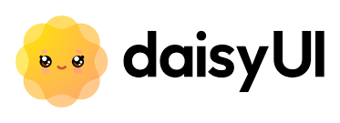
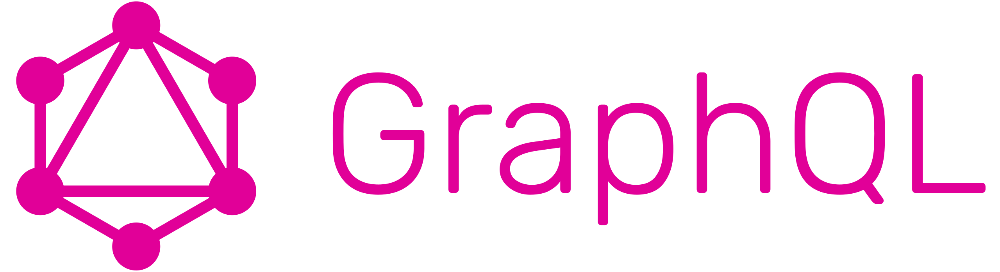
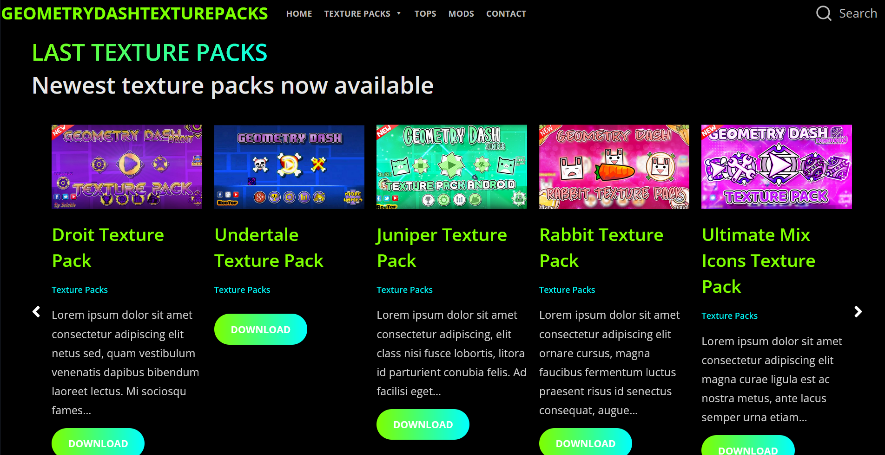
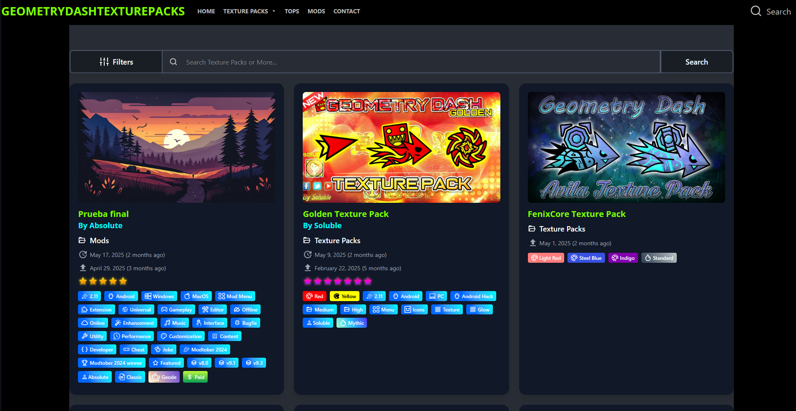
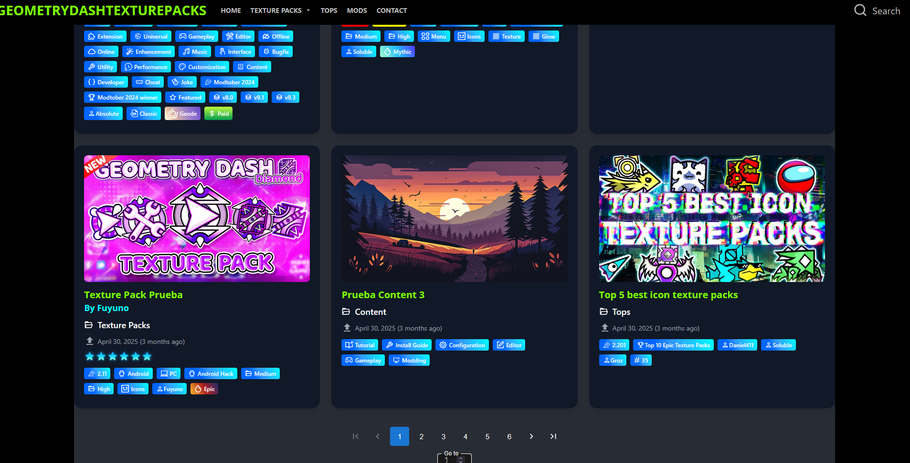
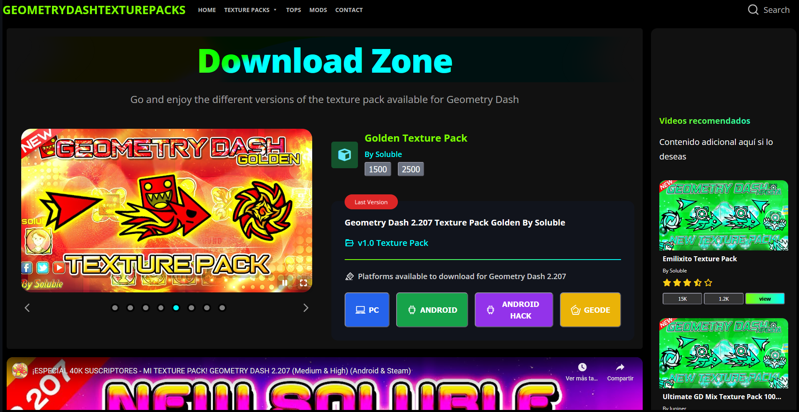
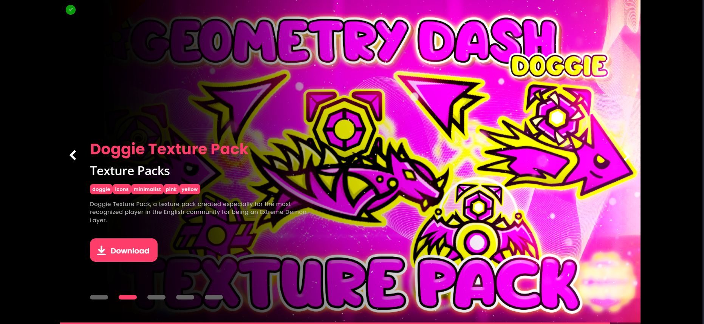

# geometrydashtexturepacks

Proyecto web dedicado a compartir paquetes de texturas para videojuegos y herramientas personalizadas.

---

## Tecnologías utilizadas

- **Frontend:** React, TailwindCSS, DaisyUI, Material UI
- **Backend:** GraphQL, MySQL
- **Búsqueda:** Meilisearch
- **Infraestructura:** Contabo VDS, Cloudflare CDN

---

## Despliegue

- Pruebas realizadas en Contabo VDS y Cloudflare CDN  
  
  

---

## Descripción del proyecto

Sitio web moderno dedicado a compartir paquetes visuales para videojuegos y herramientas de experiencia para el público.  
**Estado:** En desarrollo y despliegue.

---

## Demostración de interfaces

**Página de inicio:**  

**Carousel principal:**  

**Búsqueda de entradas:**  

**Presentación de entradas:**  

**Paginación de entradas:**  

**Zona de descarga:**  

**Presentación alternativa de menú:**  

---