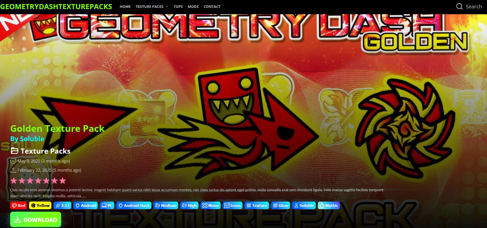

# geometrydashtexturepacks
Proyecto web para compartir paquetes de texturas para videojuegos y herramientas personalizadas

## Demostración de interfaces

**Página de inicio:**  

**Carousel Principal:**  

**Búsqueda de entradas:**  

**Presentación de entradas:**  

**Paginación de entradas:**  

**Zona de Descarga:**  

**Presentación alternativa de menú:**  

---